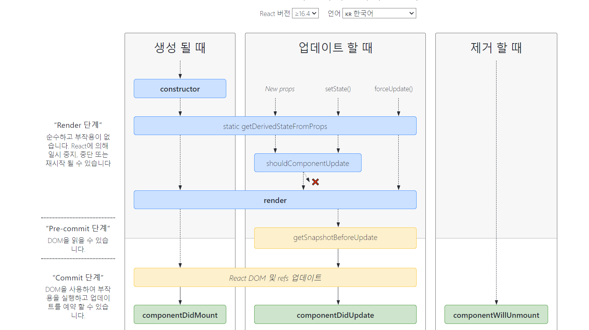

# Life Cycle Method

- **생명주기 메서드**란 컴포넌트가 화면에서 나타날부터 없어질 때까지의 생명주기를 표현한 메서드들이다.

- **클래스 컴포넌트에서만 사용**할 수 있으며 함수형 컴포넌트에서는 이와 비슷하게 구현할 수 있는 **_Hook_**이 존재한다.

요즘은 클래스 컴포넌트를 거의 사용하지는 않지만 라이프사이클을 useEffect나 memoizing에도 비슷한 맥락으로 적용된다.
때문에 클래스 컴포넌트의 라이프 사이클을 이해하고 있어야 자주 사용하는 useEffect나 memoizing을 쉽게 이해할 수 있다.

## 용도

컴포넌트가

- 마운트(처음 렌더링될 때)될 때
- 업데이트될 때(props 및 state 등이 바뀌는 경우)
- 사라질 때

  의 주기에서 어떠한 동작을 할 수 있도록 해준다.

즉, 컴포넌트가 처음 나타날때부터 없어질때까지의 과정을 메서드로 나타낸 것이며 **이러한 특정 시점에 해당 메서드를 사용하여 해당 주기에 원하는 기능을 구현**할 수 있다.

## 기능

- Mount : 컴포넌트가 **화면에 나타냈을 때**
- Update : 컴포넌트가 **업데이트** 됬을 때
- Unmount : 컴포넌트가 **사라질 때**

## class와 class component에서의 class 문법 적용

class 컴포넌트의 라이프 사이클을 알아보기전에 class 문법에 대해 간략하게 알아보자.

```js
class Person {}

class Person extends Component{

constructor(props){
super(props)
}
  render(){

    const {height,name} = this.props
    return ..
  }
}


<Person height= '184' name ='jev'/>
// 위 클래스의 인스턴스이며 constructor에 props가 전달된다.


```

자바스크립트의 프로토타입 기반 문법을 클래스 기반 문법처럼 사용할 수 있도록하는 문법이다.
클래스 기반 객체지향 프로그래밍을 제시하며 ES6문법이다.

생성자 함수와 비슷하게 프로토타입 기반 인스턴스를 생성한다.

### extends,super keyward

class를 extends,super 키워드로 다른 class에 상속할 수 있다.
extends라는 키워드를 사용하여 상속을 통해 기존 클래스를 확장할 수 있다.

서브클래스내에서 super를 호출하면 수퍼클래스(기존 클래스)의 constructor를 호출한다.
그리고 수퍼클래스의 constructor내에서 사용할 수 있는 속성들을 서브 클래스에 전달할 수 있다.

```js
class Base {
  constructor(a, b) {
    this.a = a;
    this.b = b;
  }
}

class Sub extends Base {
  constructor(a, b, c) {
    super(a, b);
    this.c = c;
  }
}

const instance = new Sub(1, 2, 3);
// instance.a = 1; instance.b = 2; instance.c = 3
```

클래스 컴포넌트에서 constructor내에서 state와 props를 정의한다.
이러한 원리로 클래스 컴포넌트에서 super에 props를 할당하며 컴포넌트에 전달해 줄 수 있는 것이다.

```js
class Counter extends Component {
  constructor(props) {
    super(props);
    this.state = {
      count: 0,
    };
  }
}
```

클래스형 컴포넌트에서 constructor를 작성할 때 반드시 super(props)를 호출해 주어야 한다.
이 함수가 호출되면 현재 클래스형 컴포넌트가 상속받고 있는 리액트의 Component 클래스가 지닌 생성자 함수를 호출하게 해준다.

### class 몸체내에서 정의가능한 메서드

클래스 몸체에서 정의할 수 있는 메서드는 constructor(생성자), 프로토타입 메서드, 정적 메서드 세가지가 있다.

- constructor는 인스턴스에 대한 프로퍼티를 지정해줄 수 있는 메서드이다.
- 프로토타입은 프로퍼티나 메서드를 상속할 수 하는 메서드이다.
- 정적 메서드는 class의 식별자에서만 바로 사용할 수 있는 메서드이다. 인스턴스에서는 사용할 수 없다.

**class**

```js
class Person {
  constructor(name) {
    this.name = name;
  }

  // 프로토타입 메서드
  sayHi() {
    console.log(`Hello,${this.name}`);
  }

  // 정적 메서드
  static sayHello() {
    console.log("Hello, World!");
  }
}

const jev = new Person("jev");

// jev.name => 'jev'
// jev.sayHi() => 'Hello, jev'
// Person.sayHello() => Hello,World
```

**생성자 함수**

```js
function Person(name) {
  this.name = name;
}

Person.prototype.sayHi = function () {
  console.log(`Hello,${this.name}`);
};

Person.sayHello = function () {
  console.log("Hello, World!");
};
```

위 예시를 봤을 때 class가 더 명시적이라는 것을 확인할 수 있다.

인스턴스에 대한 속성을 정의하는 생성자를 constructor라고 명시적으로 키워드를 지정해준 부분과 정적 메서드를 static이라는 키워드를 사용한 부분에서 사용 역할을 명확히ㅣ 구분할 수 있다.

또한 클래스 몸체에서 정의한 메서드는 생성자 함수에 의한 객체 생성 방식과는 다르게 클래스의 prototype 프로퍼티에 메서드를 추가하지 않아도 기본적으로 프로토타입 메서드가 된다.

### 클래스 필드

class 몸체 내부에서 선언하여 프로토타입이 아닌 인스턴스의 프로퍼티를 지정할 수 있는 필드이다.

```js

class Person(){

  type = 'person'

  sayHi = () => {
    console.log('Hello');
  }
}


const person1 = new Person()

person1.type // 'person'
```

클래스 필드 문법을 사용하여 클래스 컴포넌트내에서 state를 몸체 내부에서 선언하여 사용할 수 있다.

```js
class Counter extends Component {
  state = { number: 0, checked: false };

  render() {
    const { number, checked } = this.state;
  }
}
```

#### [this bind issue](https://reactjs.org/docs/faq-functions.html#how-do-i-bind-a-function-to-a-component-instance)

this는 호출부에 따라 결정되므로 정의한 핸들러가 html요소의 이벤트로 등록되는 과정에서 메서드와 this관계가 끊어진다.
이벤트가 발생할 때 핸들러가 실행되는 것이므로 this는 인스턴스를 가리킬 수 없는 것이다.
그래서 클래스 필드 문법을 활용하면 이벤트 핸들러를 참조할 때 render()에서 this를 undefined되지 않게 하기 위해 constructor에서 바인딩할 필요가 없어진다.

이 때 주의할 것은 핸들러를 정의할 때 **함수 선언문이 아닌 함수 표현식으로 함수를 생성해야한다**는 것을 명심해야한다.

**this bind**

```js
class Foo extends Component {
  constructor(props) {
    super(props);
    this.handleClick = this.handleClick.bind(this);
  }
  handleClick() {
    console.log("Click happened");
  }
  render() {
    return <button onClick={this.handleClick}>Click Me</button>;
  }
}
```

**Class Properties (ES2022)**

```js
class Foo extends Component {
  handleClick = () => {
    console.log("Click happened");
  };
  render() {
    return <button onClick={this.handleClick}>Click Me</button>;
  }
}
```

### private

class내부에서만 사용할 값은 변수앞에 #을 붙여 사용하면 된다.

```js
class Person {
  #name = "";

  constructor(name) {
    this.#name = name; // 참조가능
  }
}

const jev = new Person("jev");

jev.#name; // 참조 불가
```

## 라이프 사이클 메서드의 종류



라이프사이클 메서드의ㅣ 종류는 총 9가지이다.

will 접두사가 붙은 메서드는 어떤 작업을 하기전에 실행되는 메서드이고, Did 접두사가 붙은 메서드는 어떤 작업을 한 후에 실행되는 메서드이다.

라이프사이클은 총 세가지로써 마운트(mount),업데이트(update),언마운트(unmount)로 나눌 수 있다.

- 마운트 : 컴포넌트가 화면에 나타나는 것을 마운트라고 표현한다. DOM이 생성되고 웹 브라우저상에 나타난다.

**마운트할 때 호출하는 메서드**

1. constructor : 컴포넌트를 새로 만들 때마다 호출되는 클래스 생성자 메서드이다.

2. getDerivedStateFromProps : props에 있는 값을 state에 넣을 때 사용하는 메서드이다.

3. render : 리액트 요소들을 렌더링하는 메서드이다.

4. componentDidmount : 컴포넌트가 화면에 나타난 후 즉, DOM이 생성된 이후 호출되는 메서드이다.

- 업데이트 : 리렌더링되면서 컴포넌트의 데이터와 뷰가 업데이트된다.

### 컴포넌트가 리렌더링 되는 경우

컴포넌트는 다음과 같은 경우에 리렌더링되면서 업데이트된다.

    - props값이 변경될 때
    - state값이 변경될 때
    - 부모 컴포넌트가 리렌더링될 때(부모 컴포넌트가 리렌더링되면 자식 컴포넌트도 전부 리렌더링된다.)

**업데이트될 때 호출하는 메서드**

1. getDerivedStateFromProps

2. shouldComponentUpdate : 컴포넌트의 리렌더링 여부를 결정해주는 메서드이다.
   true나 false를 반환하며 true면 컴포넌트가 update되며 false면 컴포넌트가 update되지 않는다.

3. render

4. getSnapshotBeforeUpdate : 컴포넌트 변화를 DOM에 반영하기 바로 직전에 호출되는 메서드이다.

5. componentDidUpdate : 컴포넌트의 업데이트 작업이 끝난 후 호출하는 메서드이다.

- 언마운트 : 컴포넌트가 화면에서 사라지는 것을 언마운트라고 표현한다.

1. componentWillUnmount : 컴포넌트가 화면에서 사라지기 전에 호출되는 메서드이다.
   컴포넌트가 사라질 때 즉 다른 화면으로 전환될 때 특정 state를 초기화하고 싶다면 이 메서드에서 하면 된다.

따라서 라이프사이클은 컴포넌트가 화면에 나타났을 때, 업데이트 됬을 때, 컴포넌트가 사라질 때 개발자가 구현하고 싶은 기능을 해당 시점에 구현하면 된다.

## constructor()

`constructor(props)`

- **state 설정과 메서드 바인딩**을 하는 곳이다.
- 메서드를 바인딩하거나 state를 초기화하는 작업이 없다면, 해당 React 컴포넌트에는 생성자를 구현하지 않아도 된다.
  클래스 필드 문법(ES2022)을 사용하면 constructor를 사용하지 않아도 된다.
- **마운트되기 전에 호출**된다.
- **super(props)를 호출**하며 props를 전달하여 사용한다.(클래스 몸체에서 바로 선언하면 사용할 수 있다.)
- constructor() 내부에서 **setState()를 호출하면 안된다.**

## getDerivedStateFromProps

```js
static getDerivedStateFromProps(props, state){

  if(props.value !== state.value){
    return {value : props.vlaue}
  }

  return null
}


```

- **props 값을 state에 쓰고 싶을 때** 사용한다.
- getDerivedStateFromProps는 **최초 마운트 시와 갱신 시 모두에서 render 메서드를 호출하기 직전에 호출**된다.

- props값을 state에 쓰는 이유는 뭘까?
  부모컴포넌트에서 정의한 state값을 자식 컴포넌트로 넘겨줘 자식 컴포넌트의 state값으로 사용하는 경우 사용한다.

밑 예시는 이상하긴 하지만 state값을 다른 state값의 초깃값으로 사용하기 사용한다.
이는 보통 state값이 항상 변하지 않고 내가 부분적으로 원할 때만 바뀌게 하기 위해서 다른 state값으로 사용한다.

```js
class Child extends Component {
  state = {
    myNumber: this.props.number,
  };

  render() {
    return (
      <>
        <h1>{this.state.myNumber}</h1>
      </>
    );
  }
}

class Parent extends Component {
  state = {
    count: 0,
  };

  render() {
    return <Child number={this.state.count} />;
  }
}
```

## render()

`render()`

- class component에서 **유일하게 존재해야하는 메서드**이다.
- JSX를 사용하여 **리액트 요소들을 렌더링**할 수 있다.
- render() 메서드는 **순수해야한다**.
  **state값을 변경하면 안되고 호출할 때마다 동일한 결과를 반환**해야한다.
  또한 **브라우저와 직접적으로 상호작용하지 않는다.**
  > **브라우저와 상호 작용이 필요한 작업**은 ComponentDidMount나 다른 생명주기 메서드에서 구현해야한다.
  > 리액트 요소들이 **렌더링된 이후에 요소들이 완성**되기 때문에 이후의 작업에서 요소들을 건드리는 작업을 해야한다.

주의해야할 점은 이 메서드 안에서는 이벤트 핸들러가 아닌 곳에서 setState를 사용하면 안된다.
또한 이 메서드안에서는 DOM에 직접적으로 접근하면 안된다.
render 리액트 요소들을 그려주는 곳이기 때문에 만들어지지않은 DOM에 접근하려 하면 에러가 발생할 수 있다.

### (중요)setState를 사용할 수 있는 곳

setState는 state를 변경한다. state변경은 컴포넌트를 리렌더링시킨다.
만약 클래스 컴포넌트의 render()나 함수 컴포넌트의 반환문 이전에 useEffect에 사용하지않고 외부에서 setState를 사용한다고 해보자.
해당 부분은 리액트요소를 만들어주는 부분이며 또 state값을 사용하고 있을 것인데 거기서 state를 업데이트하면 state가 제대로 반영되지 못할 뿐더러 계속해서 렌더링된다.
render라는 메서드는 리액트 요소들을 그려주는 부분인데 이곳에서 리렌더링을 발생시키면 다시 render메서드가 작용되면서 리렌더링이 발생되고 또 render메서드를 반복한다.
이러한 반복이 계속되기때문에 무한리렌더링이 되는 것이다.

때문에 setState는 특정시점에 변경할 수 있도록 해줘야한다.

- 이벤트 핸들러(이벤트 핸들러는 비동기적으로 작동하며 setState도 비동기적으로 작동한다.)
- componentDidMount
- componentDidUpdate

## [ComponentDidMount](https://reactjs.org/docs/react-component.html#componentdidmount)

`componentDidMount()`

DOM을 참조하거나 state에 변화를 주고 싶을 때 사용하면 된다.

- 컴포넌트가 **마운트된 직후에 해당 메서드가 호출**된다.
  하지만 해당 메서드가 꼭 한번만 실행되는 것은 아니다.
  만약 해당 컴포넌트의 props의 key값이 지속적으로 바뀐다면 해당 컴포넌트는 key 값이 바뀔 때마다 마운트된다.

Ref

- https://linguinecode.com/post/understanding-react-componentdidmount

- **DOM 노드가 있어야 하는 초기화 작업**은 이 메서드에서 이루어지면 된다.
- **외부에서 데이터를 불러와야 한다면,** 네트워크 요청을 보내기 적절한 위치이다.(비동기 처리)

### 왜 이 메서드에서 네트워크 요청을 해야하는 것일까?

componentDidMount이전에 네트워크 요청을 하면 데이터값을 제대로 응답받지 못할 수도 있기 때문이다.

또한 data를 응답받아올 때는 state로 설정해야한다.
네트워크 요청(fetch,axios)은 비동기적으로 동작하며 setState도 비동기적으로 동작한다.
하지만 data값을 state값으로 설정하지않고 변수값으로 할당하면 해당 변수값을 프로미스내에서 변경해야한다.
그러나 비동기함수는 모든 코드가 모두 실행된 뒤에 반영되므로 위 방법은 데이터값이 반영되지 못한다.

```js
import React from "react";

const App = () => {
  let data = null;

  fetch("https://jsonplaceholder.typicode.com/todos/1")
    .then((response) => response.json())
    .then((json) => (data = json));

  return (
    <>
      <h1>{data}</h1>
    </>
  );
};

export default App;
```

위처럼 해당 데이터를 조회하면 데이터는 null이다. 즉 비동기이기 때문에 반영되지 않는 것이다.
그렇기 때문에 setState로 데이터값을 설정해줘야하며 dom이 완성된 이후에 응답받아야하므로 componentDidMount에서 네트워크 요청을 하는 것이 맞다.

이 메서드는 처음 렌더링이 된 이후에 state변경으로 인해 추가적인 리렌더링을 발생시킨다.
그래서 componentDidMount에서 setState로 state값을 변경하면 처음 화면에서는 두 번 렌더링이 발생하는 것이다.

## shouldComponentupdate

`shouldComponentUpdate(nextProps, nextState)`

- shouldComponentUpdate()는 **props 또는 state가 새로운 값으로 갱신되어서 렌더링이 발생하기 직전에 호출**된다.
- 이 메서드는 **초기 렌더링 또는 forceUpdate()가 사용될 때**에는 호출되지 않는다.

## render()

`render()`

- class component에서 유일하게 존재해야하는 메서드이다.
- JSX를 사용하여 리액트 요소들을 렌더링할 수 있다.
- render() 메서드는 순수해야한다.
  state값을 변경하면 안되고 호출할 때마다 동일한 결과를 반환해야한다.
  또한 브라우저와 직접적으로 상호작용하지 않는다.
  > **브라우저와 상호 작용이 필요한 작업**은 ComponentDidMount나 다른 생명주기 메서드에서 구현해야한다.
  > 리액트 요소들이 **렌더링된 이후에 요소들이 완성**되기 때문에 이후의 작업에서 요소들을 건드리는 작업을 해야한다.

## getSnapShotBeforeUpdate

` getSnapshotBeforeUpdate(prevProps, prevState)`

- getSnapshotBeforeUpdate()는 **가장 마지막으로 렌더링된 결과가 DOM 등에 반영되기 전에 호출**된다.
- 이 메서드를 사용하면 컴포넌트가 DOM으로부터 스크롤 위치 등과 같은 정보를 이후 **변경되기 전에** 얻을 수 있다.
- 이 생명주기 메서드가** 반환하는 값은 componentDidUpdate()에 인자로 전달**된다.

## componentDidUpdate

`componentDidUpdate(prevProps, prevState, snapshot)`

componentDidUpdate는 업데이트된 이후에 이전 props와 이전 state를 참조하여 로직을 구현할 수 있는 곳이다.

- 이 메서드는 **갱신이 일어난 직후에 호출**된다. 최초렌더링에는 호출되지 않는다.
- 컴포넌트가 갱신되었을 때 **DOM을 조작하기 위해** 해당 메서드를 활용하면 좋다.
- setState()를 사용할 수 있지만, **추가적인 렌더링이 발생하여 성능 저하를 발생시킬 수 있고 무한 렌더링을 발생**시킬 수 있다.
  때문에 **조건문**으로 조건을 걸어 렌더링 해줘야한다.
  (state가 변경되면 리렌더링됨.)
- **snapshot : getSnapshotBeforeUpdate()의 반환값**

---

### ⏹ UnMount

#### ✏️ ComponentWillUnmount

`componentWillUnmount()`

- 컴포넌트가 **마운트 해제되어 제거되기 직전에 호출**된다.
- 이 메서드 내에서 **타이머 제거, 네트워크 요청 취소, componentDidMount() 내에서 생성된 데이터 불러오기 해제** 등 필요한 모든 정리 작업을 수행한다.

- 이제 컴포넌트는 다시 렌더링되지 않으므로, componentWillUnmount() 내에서 **setState()를 호출하면 안된다.**
